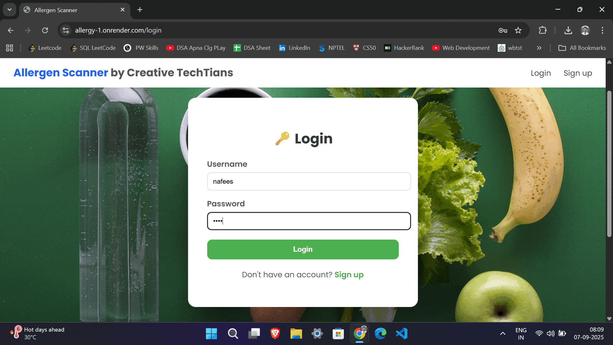
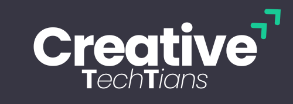

# 🌟 Allergen Scanner by Creative Techtians  

🚀 A modern **AI-powered allergen detection & ingredient analysis platform** built by **Creative Techtians**.  
This web application allows users to **scan food labels (via image/QR code)**, detect allergens from their **personal health profile**, and receive **smart food recommendations** for safe consumption.  

---

## 📸 Demo Screenshot  

<p align="center">
  
</p>

---

## ⚡ Features  

### 🔍 Core Functionalities  
- 📷 **OCR Scanning** – Extract ingredients from labels using **Tesseract OCR**  
- 🧾 **Ingredient Parsing** – Compare with personalized **allergen database (SQLite)**  
- ⚡ **Real-Time Alerts** – Instantly notify users if allergens are detected  
- 🧠 **AI Assistance** – (Optional) Enhance results with **Gemini/GPT** for health insights  

### 🎨 UI & UX  
- 💻 **Responsive Web Interface** (Flask + HTML + CSS + JS)  
- 🎭 **Team Showcase Footer** – Modern circular profile cards for contributors  
- 🌐 **Deployment Ready** – Works with **Vercel (Frontend)** & **Flask Backend**  

---

## 🛠️ Tech Stack  

| Layer       | Technology |
|-------------|------------|
| **Frontend** | HTML, CSS (Poppins), JavaScript |
| **Backend** | Python (Flask) |
| **Database** | SQLite |
| **AI/ML**   | Tesseract OCR, Gemini API (optional) |
| **Deployment** | Vercel + Flask Hosting |

---

## 👨‍💻 Meet the Team – Creative Techtians  

We’re a passionate crew of developers and innovators ✨ who believe in **making food safety smarter with AI**.  

| Member | Role | Superpower 🚀 |
|--------|------|---------------|
| **Nafees Hossain** | 💡 Developer & Team Lead | Full-stack wizard, project architect, always shipping cool features |
| **Souvik Chel** | 🧪 Tester & Frontend Developer | Bug buster + pixel-perfect UI design |
| **Dhritiman Bera** | ⚙️ Backend & Database Engineer | API master + SQLite guru |
| **Tanvi Jesmi** | 🎨 UI/UX Designer | Creates clean, modern, user-friendly interfaces |

---

## 📂 Project Structure  

```bash
allergen-scanner/
│── app.py               # Flask backend
│── static/
│   ├── style.css        # CSS styling
│   ├── scan.js          # Frontend scanning logic
│── templates/
│   ├── index.html       # Homepage
│   ├── dashboard.html   # User dashboard
│   ├── footer.html      # Team showcase footer
│── database.db          # SQLite database
│── README.md            # Project documentation
```

---
<p align="center">
  
</p>

<p align="center">🔥 Eat Smart. Live Safe. Built with ❤️ by <b>Creative Techtians</b></p>

